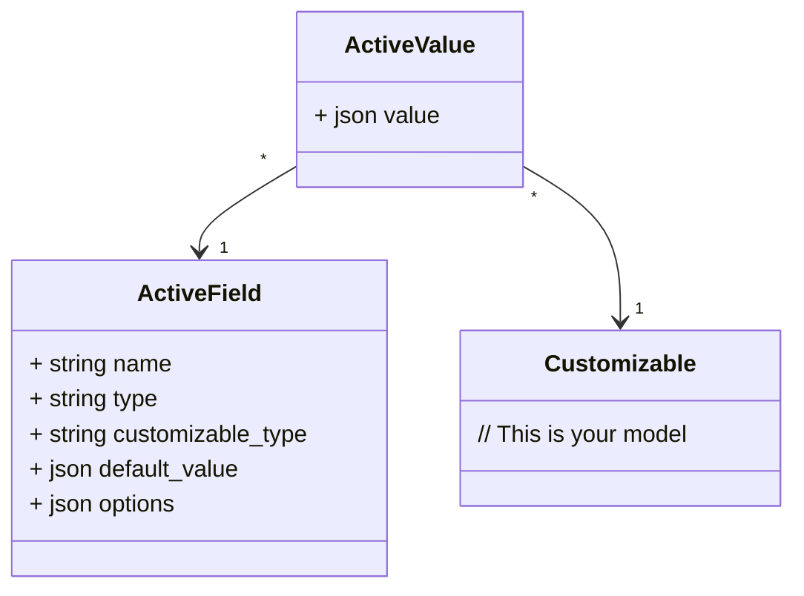

# ActiveFields

[](https://rubygems.org/gems/active_fields)
[](https://rubygems.org/gems/active_fields)
[](https://github.com/lassoid/active_fields/actions/workflows/main.yml)

**ActiveFields** is a Rails plugin that implements the Entity-Attribute-Value (EAV) pattern,
enabling the addition of custom fields to any model at runtime without requiring changes to the database schema.

## Key Concepts

- **Active Field**: A record with the definition of a custom field.
- **Active Value**: A record that stores the value of an _Active Field_ for a specific _Customizable_.
- **Customizable**: A record that has custom fields.

## Models Structure



All values are stored in a JSON (jsonb) field, which is a highly flexible column type capable of storing various data types,
such as booleans, strings, numbers, arrays, etc.

## Installation

1. Install the gem and add it to your application's Gemfile by running:

    ```shell
    bundle add active_fields
    ```

2. Add the plugin migrations to your app and run them:

    ```shell
    bin/rails active_fields:install
    bin/rails db:migrate
    ```

3. Add the `has_active_fields` method to any models where you want to enable custom fields:

    ```ruby
    class Author < ApplicationRecord
      has_active_fields
    end
    ```

4. Implement the necessary code to work with _Active Fields_.

   This plugin provides a convenient API and helpers, allowing you to write code that meets your specific needs
   without being forced to use predefined implementations that is hard to extend.

   Generally, you should:
    - Implement a controller and UI for managing _Active Fields_.
    - Add inputs for _Active Values_ in _Customizable_ forms.
    - Permit _Active Values_ parameters in _Customizable_ controllers.

        Use the helper method `active_fields_permitted_attributes` to pass necessary filters to the `permit` method,
        allowing all _Active Values_ for a given _Customizable_ to be correctly permitted.
        This helper is available by default in _controllers_.
        If you need to use it in other places (e.g., in _policies_), simply include `ActiveFields::Helper` wherever it's needed.

        ```ruby
        # In a controller
        class AuthorsController
          # ...
      
          def author_params
            params.require(:author).permit(
              :name,
              :group_id,
              active_values_attributes: active_fields_permitted_attributes(@author),
            )
          end
        end
      
        # In a policy
        class AuthorPolicy < ApplicationPolicy
          include ActiveFields::Helper
      
          # ...

          def permitted_attributes
            [
              :name,
              :group_id,
              active_values_attributes: active_fields_permitted_attributes(record),
            ]
          end
        end
        ```

        **Note:** By default, Rails form fields insert an empty string into array (multiple) parameters.
        You’ll need to remove these empty strings manually. 
        Here’s [one possible solution](https://github.com/lassoid/active_fields/blob/main/spec/dummy/app/controllers/authors_controller.rb#L47) 
        for handling this case.

   You can find a detailed [example](https://github.com/lassoid/active_fields/tree/main/spec/dummy) 
   of how to implement this in a full-stack Rails application.
   Feel free to explore the source code and run it locally:

    ```shell
    spec/dummy/bin/setup
    bin/rails s
    ```

## Field Types

The plugin comes with a structured set of _Active Fields_ types:


### Fields Base Attributes
- `name`(`string`)
- `type`(`string`)
- `customizable_type`(`string`)

### Field Types Summary

| Active Field model                  | Type name       | Attributes                              | Options                                                                                                                                                                                                                                                                                             |
|-------------------------------------|-----------------|-----------------------------------------|-----------------------------------------------------------------------------------------------------------------------------------------------------------------------------------------------------------------------------------------------------------------------------------------------------|
| `ActiveFields::Field::Boolean`      | `boolean`       | `default_value`<br>(`boolean` or `nil`) | `required`(`boolean`) - the value must not be `false`<br>`nullable`(`boolean`) - the value could be `nil`                                                                                                                                                                                           |
| `ActiveFields::Field::Date`         | `date`          | `default_value`<br>(`date` or `nil`)    | `required`(`boolean`) - the value must not be `nil`<br>`min`(`date`) - minimum value allowed<br>`max`(`date`) - maximum value allowed                                                                                                                                                               |
| `ActiveFields::Field::DateArray`    | `date_array`    | `default_value`<br>(`array[date]`)      | `min`(`date`) - minimum value allowed, for each element<br>`max`(`date`) - maximum value allowed, for each element<br>`min_size`(`integer`) - minimum value size<br>`max_size`(`integer`) - maximum value size                                                                                      |
| `ActiveFields::Field::Decimal`      | `decimal`       | `default_value`<br>(`decimal` or `nil`) | `required`(`boolean`) - the value must not be `nil`<br>`min`(`decimal`) - minimum value allowed<br>`max`(`decimal`) - maximum value allowed<br>`precision`(`integer`) - the precision for value rounding                                                                                            |
| `ActiveFields::Field::DecimalArray` | `decimal_array` | `default_value`<br>(`array[decimal]`)   | `min`(`decimal`) - minimum value allowed, for each element<br>`max`(`decimal`) - maximum value allowed, for each element<br>`precision`(`integer`) - the precision for value rounding, for each element<br>`min_size`(`integer`) - minimum value size<br>`max_size`(`integer`) - maximum value size |
| `ActiveFields::Field::Enum`         | `enum`          | `default_value`<br>(`string` or `nil`)  | `required`(`boolean`) - the value must not be `nil`<br>**\***`allowed_values`(`array[string]`) - a list of allowed values                                                                                                                                                                           |
| `ActiveFields::Field::EnumArray`    | `enum_array`    | `default_value`<br>(`array[string]`)    | **\***`allowed_values`(`array[string]`) - a list of allowed values<br>`min_size`(`integer`) - minimum value size<br>`max_size`(`integer`) - maximum value size                                                                                                                                      |
| `ActiveFields::Field::Integer`      | `integer`       | `default_value`<br>(`integer` or `nil`) | `required`(`boolean`) - the value must not be `nil`<br>`min`(`integer`) - minimum value allowed<br>`max`(`integer`) - maximum value allowed                                                                                                                                                         |
| `ActiveFields::Field::IntegerArray` | `integer_array` | `default_value`<br>(`array[integer]`)   | `min`(`integer`) - minimum value allowed, for each element<br>`max`(`integer`) - maximum value allowed, for each element<br>`min_size`(`integer`) - minimum value size<br>`max_size`(`integer`) - maximum value size                                                                                |
| `ActiveFields::Field::Text`         | `text`          | `default_value`<br>(`string` or `nil`)  | `required`(`boolean`) - the value must not be `nil`<br>`min_length`(`integer`) - minimum value length allowed<br>`max_length`(`integer`) - maximum value length allowed                                                                                                                             |
| `ActiveFields::Field::TextArray`    | `text_array`    | `default_value`<br>(`array[string]`)    | `min_length`(`integer`) - minimum value length allowed, for each element<br>`max_length`(`integer`) - maximum value length allowed, for each element<br>`min_size`(`integer`) - minimum value size<br>`max_size`(`integer`) - maximum value size                                                    |
| _Your custom class can be here_     | _..._           | _..._                                   | _..._                                                                                                                                                                                                                                                                                               |

**Note:** Options marked with **\*** are mandatory.

## Configuration

### Limiting Field Types for a Customizable

You can restrict the allowed _Active Field_ types for a _Customizable_ by passing _type names_ to the `types` argument in the `has_active_fields` method:

```ruby
class Post < ApplicationRecord
  has_active_fields types: %i[boolean date_array integer your_custom_field_type_name]
  # ...
end
```

Attempting to save an _Active Field_ with a disallowed type will result in a validation error:

```ruby
active_field = ActiveFields::Field::Date.new(name: "date", customizable_type: "Post")
active_field.valid? #=> false
active_field.errors.messages #=> {:customizable_type=>["is not included in the list"]}
```

### Customizing Internal Model Classes

You can extend the functionality of _Active Fields_ and _Active Values_ by changing their classes.
By default, _Active Fields_ inherit from `ActiveFields::Field::Base` (utilizing STI),
and _Active Values_ class is `ActiveFields::Value`.
You should include the mix-ins `ActiveFields::FieldConcern` and `ActiveFields::ValueConcern`
in your custom models to add the necessary functionality.

```ruby
# config/initializers/active_fields.rb
ActiveFields.configure do |config|
  config.field_base_class_name = "CustomField"
  config.value_class_name = "CustomValue"
end

# app/models/custom_field.rb
class CustomField < ApplicationRecord
  self.table_name = "active_fields" # Ensure the model uses the correct table

  include ActiveFields::FieldConcern

  # Your custom code to extend Active Fields
  def label = name.titleize
  # ...
end

# app/models/custom_value.rb
class CustomValue < ApplicationRecord
  self.table_name = "active_fields_values" # Ensure the model uses the correct table

  include ActiveFields::ValueConcern

  # Your custom code to extend Active Values
  def label = active_field.label
  # ...
end
```

### Adding Custom Field Types

To add a custom _Active Field_ type, create a subclass of the `ActiveFields.config.field_base_class` 
and register it in the global configuration.

**Note:** The _first_ argument should be the field _type name_ and the _second_ should be the field _class name_.

```ruby
# config/initializers/active_fields.rb
ActiveFields.configure do |config|
  config.register_field :ip, "IpField"
end

# app/models/ip_field.rb
class IpField < ActiveFields.config.field_base_class
  # Store specific attributes in `options`
  store_accessor :options, :required, :strip

  private

  # This method allows you to assign default values to your attributes.
  # It is automatically executed within the `after_initialize` callback.
  def set_defaults
    self.required ||= false
    self.strip ||= true
  end
end
```

For each custom _Active Field_ type, you must also define a **validator** and a **caster**:

#### Validator

Create a class that inherits from `ActiveFields::Validators::BaseValidator` and implements the `perform_validation` method.
This method is responsible for validating `active_field.default_value` and `active_value.value`, and adding any errors to the `errors` set.
These errors will then propagate to the corresponding record.
Each error should be aligned with the arguments of the _ActiveModel_ `errors.add` method.

```ruby
# app/models/ip_field.rb
class IpField < ActiveFields.config.field_base_class
  # ...
  def value_validator_class = IpValidator
  # ...
end

# lib/ip_validator.rb (or anywhere you want)
class IpValidator < ActiveFields::Validators::BaseValidator
  private

  def perform_validation(value)
    if value.nil?
      # active_field record is available!
      if active_field.required
        errors << :required # type only
      end
    elsif value.is_a?(String)
      unless value.match?(Resolv::IPv4::Regex)
        errors << [:invalid, message: "doesn't match the IPv4 format"] # type with options    
      end
    else
      errors << :invalid
    end
  end
end                                                               
```

#### Caster

Create a class that inherits from `ActiveFields::Casters::BaseCaster` 
and implements methods `serialize` (used when setting a value) and `deserialize` (used when retrieving a value).
These methods handle the conversion of `active_field.default_value` and `active_value.value`.

```ruby
# app/models/ip_field.rb
class IpField < ActiveFields.config.field_base_class
  # ...
  def value_caster_class = IpCaster
  # ...
end

# lib/ip_caster.rb (or anywhere you want)
class IpCaster < ActiveFields::Casters::BaseCaster
  def serialize(value)
    value = value&.to_s
    # active_field record is available!
    value = value&.strip if active_field.strip

    value
  end

  def deserialize(value)
    value = value&.to_s
    # active_field record is available too!
    value = value&.strip if active_field.strip

    value
  end
end
```

To create a custom array _Active Field_ type, include the `ActiveFields::FieldArrayConcern` mix-in in your model
and register it in global configuration as usual.
This will add `min_size` and `max_size` options, as well as some important internal methods such as `array?`.

```ruby
# config/initializers/active_fields.rb
ActiveFields.configure do |config|
  config.register_field :ip_array, "IpArrayField"
end

# app/models/ip_array_field.rb
class IpArrayField < ActiveFields.config.field_base_class
  include ActiveFields::FieldArrayConcern
  # ...
end
```

### Localization (I18n)

The built-in _validators_ primarily use _Rails_ default error types.
However, there are some custom error types that you’ll need to handle in your locale files:
- `size_too_short` (args: `count`): Triggered when the size of an array _Active Field_ value is smaller than the allowed minimum.
- `size_too_long` (args: `count`): Triggered when the size of an array _Active Field_ value exceeds the allowed maximum.
- `duplicate`: Triggered when an enum array _Active Field_ contains duplicate elements.

For an example, refer to the [locales file](https://github.com/lassoid/active_fields/blob/main/spec/dummy/config/locales/en.yml).

## Current Restrictions

1. Only _PostgreSQL_ is fully supported.

   The gem is tested exclusively with _PostgreSQL_. Support for other databases is not guaranteed.

   However, you can give it a try! :)

2. Updating _Active Fields_ options may be unsafe.

   This could cause existing _Active Values_ to become invalid,
   leading to the associated _Customizables_ also becoming invalid,
   which could potentially result in update failures.

## API Overview

### Fields API

```ruby
active_field = ActiveFields::Field::Boolean.take

# Associations:
active_field.active_values # `has_many` association with Active Values associated with this Active Field

# Attributes:
active_field.type # Class name of this Active Field (utilizing STI)
active_field.customizable_type # Name of the Customizable model this Active Field is registered to
active_field.name # Identifier of this Active Field, it should be unique in scope of customizable_type
active_field.default_value # Default value for all Active Values associated with this Active Field
active_field.options # A hash (json) containing type-specific attributes for this Active Field

# Methods:
active_field.array? # Returns whether the Active Field type is an array
active_field.value_validator_class # Class used for values validation
active_field.value_validator # Validator object that performs values validation
active_field.value_caster_class # Class used for values casting
active_field.value_caster # Caster object that performs values casting
active_field.customizable_model # Customizable model class
active_field.type_name # Identifier of the type of this Active Field (instead of class name)

# Scopes:
ActiveFields::Field::Boolean.for("Author") # Collection of Active Fields registered for the specified Customizable type
```

### Values API

```ruby
active_value = ActiveFields::Value.take

# Associations:
active_value.active_field # `belongs_to` association with the associated Active Field
active_value.customizable # `belongs_to` association with the associated Customizable

# Attributes:
active_value.value # The stored value for this Active Value
```

### Customizable API

```ruby
customizable = Author.take

# Associations:
customizable.active_values # `has_many` association with Active Values linked to this Customizable

# Methods:
customizable.active_fields # Collection of Active Fields registered for this record
customizable.active_values_attributes = { "boolean_field_name" => true } # Setter to create or update Active Values upon saving the Customizable
```

### Global Config

```ruby
ActiveFields.config # Access the plugin's global configuration
ActiveFields.config.fields # Registered Active Fields types (type_name => field_class)
ActiveFields.config.field_base_class # Base class for all Active Fields
ActiveFields.config.field_base_class_name # Name of the Active Fields base class
ActiveFields.config.value_class # Active Values class
ActiveFields.config.value_class_name # Name of the Active Values class
ActiveFields.config.field_base_class_changed? # Check if the Active Fields base class has changed
ActiveFields.config.value_class_changed? # Check if the Active Values class has changed
ActiveFields.config.register_field(:ip, "IpField") # Register a custom Active Field type
```

### Customizable Config

```ruby
customizable_model = Author
customizable_model.active_fields_config # Access the Customizable's configuration
customizable_model.active_fields_config.customizable_model # The Customizable model itself
customizable_model.active_fields_config.types # Allowed Active Field types (e.g., `[:boolean]`)
customizable_model.active_fields_config.types_class_names # Allowed Active Field class names (e.g., `[ActiveFields::Field::Boolean]`)
```

### Helper

```ruby
include ActiveFields::Helper

customizable = Author.take
active_fields_permitted_attributes(customizable) # Filters for the `permit` method to allow all Active Values attributes
#=> [:birthdate, { interested_products: [] }]
```

## Development

After checking out the repo, run `spec/dummy/bin/setup` to install dependencies. Then, run `bin/rspec` to run the tests.
You can also run `bin/rubocop` to lint the source code,
`bin/rails c` for an interactive prompt that will allow you to experiment
and `bin/rails s` to start the dummy app with plugin already enabled and configured.

To install this gem onto your local machine, run `bin/rake install`.
To release a new version, update the version number in `version.rb`, and then run `bin/rake release`,
which will create a git tag for the version, push git commits and the created tag,
and push the `.gem` file to [rubygems.org](https://rubygems.org).

## Contributing

Bug reports and pull requests are welcome on GitHub at https://github.com/lassoid/active_fields.
This project is intended to be a safe, welcoming space for collaboration, and contributors
are expected to adhere to the [code of conduct](https://github.com/lassoid/active_fields/blob/main/CODE_OF_CONDUCT.md).

## License

The gem is available as open source under the terms of the [MIT License](https://opensource.org/licenses/MIT).

## Code of Conduct

Everyone interacting in the ActiveFields project's codebases, issue trackers, chat rooms and mailing lists
is expected to follow the [code of conduct](https://github.com/lassoid/active_fields/blob/main/CODE_OF_CONDUCT.md).
