# ActiveFields

[](https://rubygems.org/gems/active_fields)
[](https://rubygems.org/gems/active_fields)
[](https://github.com/lassoid/active_fields/actions/workflows/main.yml)

**ActiveFields** is a Rails plugin that implements the Entity-Attribute-Value (EAV) pattern,
enabling the addition of custom fields to any model at runtime without requiring changes to the database schema.

## Key Concepts

- **Active Field**: A record with the definition of a field.
- **Active Value**: A record that stores the value of an _Active Field_ for a specific _Customizable_.
- **Customizable**: A record that has associated _Active Fields_.

## Models Structure


All values are stored in a JSON (jsonb) field, which is a highly flexible column type capable of storing various data types,
such as booleans, strings, numbers, arrays, etc.

## Installation

1. Install the gem and add it to your application's Gemfile by running:

    ```shell
    bundle add active_fields
    ```

2. Add the plugin migrations to your app and run them:

    ```shell
    bin/rails active_fields:install
    bin/rails db:migrate
    ```

3. Add the `has_active_fields` method to any models where you want to enable custom fields:

    ```ruby
    class Author < ApplicationRecord
      has_active_fields
    end
    ```

4. Implement the necessary code to work with _Active Fields_.

   This plugin provides a convenient API and helpers, allowing you to write code that meets your specific needs
   without being forced to use predefined implementations that is hard to extend.

   Generally, you should:
    - Implement a controller and UI for managing _Active Fields_.
    - Add inputs for _Active Values_ in _Customizable_ forms.
    - Permit _Active Values_ parameters in _Customizable_ controllers.

        Use the helper method `active_fields_permitted_attributes` to pass necessary filters to the `permit` method,
        allowing all _Active Values_ for a given _Customizable_ to be permitted.
        This helper is available by default in _controllers_.
        If you need to use it in other places (e.g., in _policies_), simply include `ActiveFields::Helper` wherever it's needed.

        ```ruby
        # In a controller
        class AuthorsController
          # ...
      
          def author_params
            params.require(:author).permit(
              :name,
              :group_id,
              active_values_attributes: active_fields_permitted_attributes(@author),
            )
          end
        end
      
        # In a policy
        class AuthorPolicy < ApplicationPolicy
          include ActiveFields::Helper
      
          # ...

          def permitted_attributes
            [
              :name,
              :group_id,
              active_values_attributes: active_fields_permitted_attributes(record),
            ]
          end
        end
        ```

        **Note:** By default, Rails form fields insert an empty string into array (multiple) parameters.
        You’ll need to remove these empty strings manually. 
        Here’s [one possible solution](https://github.com/lassoid/active_fields/blob/main/spec/dummy/app/controllers/authors_controller.rb#L47) 
        for handling this case.

   You can find a detailed [example](https://github.com/lassoid/active_fields/tree/main/spec/dummy) 
   of how to implement this in a full-stack Rails application.
   Feel free to explore the source code and run it locally:

    ```shell
    spec/dummy/bin/setup
    bin/rails s
    ```

## Field Types

The plugin comes with a structured set of _Active Fields_ types:

```mermaid
classDiagram
    class ActiveField {
        + string name
        + string type
        + string customizable_type
    }
    class Boolean {
        + boolean default_value
        + boolean required
        + boolean nullable
    }
    class Date {
        + date default_value
        + boolean required
        + date min
        + date max
    }
    class DateArray {
        + array~date~ default_value
        + date min
        + date max
        + integer min_size
        + integer max_size
    }
    class Decimal {
        + decimal default_value
        + boolean required
        + decimal min
        + decimal max
        + integer precision
    }
    class DecimalArray {
        + array~decimal~ default_value
        + decimal min
        + decimal max
        + integer precision
        + integer min_size
        + integer max_size
    }
    class Enum {
        + string default_value
        + boolean required
        + array~string~ allowed_values
    }
    class EnumArray {
        + array~string~ default_value
        + array~string~ allowed_values
        + integer min_size
        + integer max_size
    }
    class Integer {
        + integer default_value
        + boolean required
        + integer min
        + integer max
    }
    class IntegerArray {
        + array~integer~ default_value
        + integer min
        + integer max
        + integer min_size
        + integer max_size
    }
    class Text {
        + string default_value
        + boolean required
        + integer min_length
        + integer max_length
    }
    class TextArray {
        + array~string~ default_value
        + integer min_length
        + integer max_length
        + integer min_size
        + integer max_size
    }
    
    ActiveField <|-- Boolean
    ActiveField <|-- Date
    ActiveField <|-- DateArray
    ActiveField <|-- Decimal
    ActiveField <|-- DecimalArray
    ActiveField <|-- Enum
    ActiveField <|-- EnumArray
    ActiveField <|-- Integer
    ActiveField <|-- IntegerArray
    ActiveField <|-- Text
    ActiveField <|-- TextArray
```



**Base** fields attributes:
- `string` `name`
- `string` `type`
- `string` `customizable_type`

**Specific** fields attributes:

| Field Type   | Attributes                         | Options                                                                                                                                                                                                                                                                                        |
|--------------|------------------------------------|------------------------------------------------------------------------------------------------------------------------------------------------------------------------------------------------------------------------------------------------------------------------------------------------|
| Boolean      | + `boolean` `default_value`        | `boolean` `required` - the value must not be `false`\n `boolean` `nullable` - the value could be `nil`                                                                                                                                                                                         |
| Date         | + `date` `default_value`           | `boolean` `required` - the value must not be `nil` \n `date` `min` - minimum value allowed \n `date` `max` - maximum value allowed                                                                                                                                                             |
| DateArray    | + `array[date]` `default_value`    | `date` `min` - minimum value allowed, for each element \n `date` `max` - maximum value allowed, for each element \n `integer` `min_size` - minimum value size \n `integer` `max_size` - maximum value size                                                                                     |
| Decimal      | + `decimal` `default_value`        | `boolean` `required` - the value must not be `nil` \n `decimal` `min` - minimum value allowed \n `decimal` `max` - maximum value allowed \n `integer` `precision` - the precision for value rounding                                                                                           |
| DecimalArray | + `array[decimal]` `default_value` | `decimal` `min` - minimum value allowed, for each element \n `decimal` `max` - maximum value allowed, for each element \n `integer` `precision` - the precision for value rounding, for each element \n `integer` `min_size` - minimum value size \n `integer` `max_size` - maximum value size |
| Enum         | + `string` `default_value`         | `boolean` `required` - the value must not be `nil` \n `array[string]` `allowed_values` - a list of allowed values                                                                                                                                                                              |
| EnumArray    | + `array[string]` `default_value`  | `array[string]` `allowed_values` - a list of allowed values \n `integer` `min_size` - minimum value size \n `integer` `max_size` - maximum value size                                                                                                                                          |
| Integer      | + `integer` `default_value`        | `boolean` `required` - the value must not be `nil` \n `integer` `min` - minimum value allowed \n `integer` `max` - maximum value allowed                                                                                                                                                       |
| IntegerArray | + `array[integer]` `default_value` | `integer` `min` - minimum value allowed, for each element \n `integer` `max` - maximum value allowed, for each element \n `integer` `min_size` - minimum value size \n `integer` `max_size` - maximum value size                                                                               |
| Text         | + `string` `default_value`         | `boolean` `required` - the value must not be `nil` \n `integer` `min_length` - minimum value length allowed \n `integer` `max_length` - maximum value length allowed                                                                                                                           |
| TextArray    | + `array[string]` `default_value`  | `integer` `min_length` - minimum value length allowed, for each element \n `integer` `max_length` - maximum value length allowed, for each element \n `integer` `min_size` - minimum value size \n `integer` `max_size` - maximum value size                                                   |

## Configuration

### Limiting Field Types for a Customizable

You can restrict the allowed field types for a _Customizable_ by passing a `types` argument to the `has_active_fields` method:

```ruby
class Post < ApplicationRecord
  has_active_fields types: %i[boolean ip]
  # ...
end
```

Attempting to save an _Active Field_ with a disallowed type will result in a validation error:

```ruby
active_field = ActiveFields::Field::Date.new(name: "date", customizable_type: "Post")
active_field.valid? #=> false
active_field.errors.messages #=> {:customizable_type=>["is not included in the list"]}
```

### Customizing Internal Model Classes

You can extend the functionality of _Active Fields_ and _Active Values_ by changing their classes.
By default, _Active Fields_ inherit from `ActiveFields::Field::Base` (using STI),
and _Active Values_ is `ActiveFields::Value`.
You can include the mix-ins `ActiveFields::FieldConcern` and `ActiveFields::ValueConcern`
in your custom models to add the necessary functionality.

```ruby
# config/initializers/active_fields.rb
ActiveFields.configure do |config|
  config.field_base_class_name = "CustomField"
  config.value_class_name = "CustomValue"
end

# app/models/custom_field.rb
class CustomField < ApplicationRecord
  self.table_name = "active_fields" # Ensure the model uses the correct table

  include ActiveFields::FieldConcern

  # Your custom code to extend Active Fields
  def label = name.titleize
  # ...
end

# app/models/custom_value.rb
class CustomValue < ApplicationRecord
  self.table_name = "active_fields_values" # Ensure the model uses the correct table

  include ActiveFields::ValueConcern

  # Your custom code to extend Active Values
  def label = active_field.label
  # ...
end
```

### Registering Custom Field Types

To add a custom field type, create a subclass of the `ActiveFields.config.field_base_class` 
and register it in the global configuration:

```ruby
# config/initializers/active_fields.rb
ActiveFields.configure do |config|
  config.register_field :ip, "IpField"
end

# app/models/ip_field.rb
class IpField < ActiveFields.config.field_base_class
  # Store specific attributes in `options`
  store_accessor :options, :required, :strip

  private

  # This method allows you to assign default values to your attributes.
  # It is automatically executed within the `after_initialize` callback.
  def set_defaults
    self.required ||= false
    self.strip ||= true
  end
end
```

For each custom field type, you must also define a **validator** and a **caster**:

#### Validator

Inherit from the `ActiveFields::Validators::BaseValidator` and implement the `perform_validation` method.
This method is responsible for validating the field’s value and adding any errors to the `errors` set.
These errors will then propagate to the associated _Active Value_ and _Customizable_ records.
Each error should be aligned with the arguments of the _ActiveModel_ `errors.add` method.

```ruby
# app/models/ip_field.rb
class IpField < ActiveFields.config.field_base_class
  # ...
  def value_validator_class = IpValidator
  # ...
end

# lib/ip_validator.rb (or anywhere you want)
class IpValidator < ActiveFields::Validators::BaseValidator
  private

  def perform_validation(value)
    if value.nil?
      # active_field record is available!
      if active_field.required
        errors << :required # type only
      end
    elsif value.is_a?(String)
      unless value.match?(Resolv::IPv4::Regex)
        errors << [:invalid, message: "doesn't match the IPv4 format"] # type with options    
      end
    else
      errors << :invalid
    end
  end
end                                                               
```

#### Caster

Inherit from ActiveFields::Casters::BaseCaster and implement the `serialize` method (used when setting a value)
and the `deserialize` method (used when retrieving a value).
These methods handle the conversion of values to and from the database format.

```ruby
# app/models/ip_field.rb
class IpField < ActiveFields.config.field_base_class
  # ...
  def value_caster_class = IpCaster
  # ...
end

# lib/ip_caster.rb (or anywhere you want)
class IpCaster < ActiveFields::Casters::BaseCaster
  def serialize(value)
    value = value&.to_s
    # active_field record is available!
    value = value&.strip if active_field.strip

    value
  end

  def deserialize(value)
    value = value&.to_s
    # active_field record is available too!
    value = value&.strip if active_field.strip

    value
  end
end
```

To create an array field type, include the `ActiveFields::FieldArrayConcern` mix-in in your field model
and register it in global configuration as usual.
This will add `min_size` and `max_size` options, as well as some important internal methods such as `array?`.

```ruby
# config/initializers/active_fields.rb
ActiveFields.configure do |config|
  config.register_field :ip_array, "IpArrayField"
end

# app/models/ip_array_field.rb
class IpArrayField < ActiveFields.config.field_base_class
  include ActiveFields::FieldArrayConcern
  # ...
end
```

## API Overview

### Fields API

```ruby
active_field = ActiveFields::Field::Boolean.take

# Associations:
active_field.active_values # `has_many` association with values associated with this field

# Attributes:
active_field.type # Class name of the field (used for STI)
active_field.customizable_type # Name of the Customizable model the field is registered to
active_field.name # Identifier for the field, it should be unique in scope of customizable_type
active_field.default_value # Default value for all instances of this field
active_field.options # A hash (json) containing type-specific attributes for the field

# Methods:
active_field.array? # Returns whether the field is an array
active_field.value_validator_class # Class used for value validation
active_field.value_validator # Validator object that validates values
active_field.value_caster_class # Class used to cast (serialize/deserialize) values
active_field.value_caster # Caster object that performs value casting
active_field.customizable_model # Customizable model class
active_field.type_name # Name identifying the field type without using class names

# Scopes:
ActiveFields::Field::Boolean.for("Author") # Retrieves fields registered for the specified Customizable type
```

### Values API

```ruby
active_value = ActiveFields::Value.take

# Associations:
active_value.active_field # `belongs_to` association with the associated Active Field
active_value.customizable # `belongs_to` association with the associated Customizable

# Attributes:
active_value.value # The stored value for this Active Value
```

### Customizable API

```ruby
customizable = Author.take

# Associations:
customizable.active_values # `has_many` association with values linked to this Customizable

# Methods:
customizable.active_fields # Collection of fields registered for this record
customizable.active_values_attributes = { "boolean_field_name" => true } # Setter to create or update Active Values upon saving the Customizable
```

### Global config

```ruby
ActiveFields.config # Access the plugin's global configuration
ActiveFields.config.fields # Registered field types (type_name => field_class)
ActiveFields.config.field_base_class # Base class for all fields
ActiveFields.config.field_base_class_name # Name of the field base class
ActiveFields.config.value_class # Class for storing values
ActiveFields.config.value_class_name # Name of the value class
ActiveFields.config.field_base_class_changed? # Check if the field base class has changed
ActiveFields.config.value_class_changed? # Check if the value class has changed
ActiveFields.config.register_field(:ip, "IpField") # Register a custom field type
```

### Customizable config

```ruby
customizable_model = Author
customizable_model.active_fields_config # Access the Customizable's configuration
customizable_model.active_fields_config.customizable_model # The Customizable model itself
customizable_model.active_fields_config.types # Allowed field types (e.g., `[:boolean]`)
customizable_model.active_fields_config.types_class_names # Allowed field class names (e.g., `[ActiveFields::Field::Boolean]`)
```

### Helper

```ruby
include ActiveFields::Helper

customizable = Author.take
active_fields_permitted_attributes(customizable) # Filters for the `permit` method to allow all Active Values attributes
#=> [:birthdate, { interested_products: [] }]
```

## Development

After checking out the repo, run `spec/dummy/bin/setup` to install dependencies. Then, run `bin/rspec` to run the tests.
You can also run `bin/rubocop` to lint the source code,
`bin/rails c` for an interactive prompt that will allow you to experiment
and `bin/rails s` to start the dummy app with plugin already enabled and configured.

To install this gem onto your local machine, run `bin/rake install`.
To release a new version, update the version number in `version.rb`, and then run `bin/rake release`,
which will create a git tag for the version, push git commits and the created tag,
and push the `.gem` file to [rubygems.org](https://rubygems.org).

## Contributing

Bug reports and pull requests are welcome on GitHub at https://github.com/lassoid/active_fields.
This project is intended to be a safe, welcoming space for collaboration, and contributors
are expected to adhere to the [code of conduct](https://github.com/lassoid/active_fields/blob/main/CODE_OF_CONDUCT.md).

## License

The gem is available as open source under the terms of the [MIT License](https://opensource.org/licenses/MIT).

## Code of Conduct

Everyone interacting in the ActiveFields project's codebases, issue trackers, chat rooms and mailing lists
is expected to follow the [code of conduct](https://github.com/lassoid/active_fields/blob/main/CODE_OF_CONDUCT.md).
