# ActiveFields

[](https://rubygems.org/gems/active_fields)
[](https://rubygems.org/gems/active_fields)
[](https://github.com/lassoid/active_fields/actions/workflows/main.yml)

**ActiveFields** is a _Rails_ plugin that implements the _Entity-Attribute-Value_ (_EAV_) pattern,
enabling the addition of custom fields to any model at runtime without requiring changes to the database schema.

## Table of Contents

- [Key Concepts](#key-concepts)
- [Models Structure](#models-structure)
- [Requirements](#requirements)
- [Installation](#installation)
- [Field Types](#field-types)
  - [Fields Base Attributes](#fields-base-attributes)
  - [Field Types Summary](#field-types-summary)
  - [Search Functionality](#search-functionality)
- [Configuration](#configuration)
  - [Limiting Field Types for a Customizable](#limiting-field-types-for-a-customizable)
  - [Customizing Internal Model Classes](#customizing-internal-model-classes)
  - [Adding Custom Field Types](#adding-custom-field-types)
  - [Scoping](#scoping)
  - [Localization (I18n)](#localization-i18n)
- [Current Restrictions](#current-restrictions)
- [API Overview](#api-overview)
  - [Fields API](#fields-api)
  - [Values API](#values-api)
  - [Customizable API](#customizable-api)
  - [Global Config](#global-config)
  - [Registry](#registry)
- [Development](#development)
- [Contributing](#contributing)
- [License](#license)

## Key Concepts

- **Customizable**: A record that has custom fields (_Entity_).
- **Active Field**: A record with the definition of a custom field (_Attribute_).
- **Active Value**: A record that stores the value of an _Active Field_ for a specific _Customizable_ (_Value_).

## Models Structure


All values are stored in a JSON (jsonb) field, which is a highly flexible column type capable of storing various data types,
such as booleans, strings, numbers, arrays, etc.

## Requirements

- Ruby 3.1+
- Rails 7.1+
- Postgres 15+ (17+ for search functionality)

## Installation

1. Install the gem and add it to your application's Gemfile by running:

    ```shell
    bundle add active_fields
    ```

2. Run install generator, then run migrations:

    ```shell
    bin/rails generate active_fields:install
    bin/rails db:migrate
    ```

3. Add the `has_active_fields` method to any models where you want to enable custom fields:

    ```ruby
    class Post < ApplicationRecord
      has_active_fields
    end
    ```

4. Run scaffold generator.

    This plugin provides a convenient API, allowing you to write code that meets your specific needs
    without being forced to use predefined implementations that is hard to extend.

    However, for a quick start, you can generate a scaffold by running the following command:

    ```shell
    bin/rails generate active_fields:scaffold
    ```

    This command generates a controller, routes, views for managing _Active Fields_,
    along with form inputs for _Active Values_, search form and some useful helper methods that will be used in next steps.

    **Note:** The array field helper and search form use _Stimulus_ for interactivity.
    If your app doesn't already include _Stimulus_, you can [easily add it](https://github.com/hotwired/stimulus-rails).
    Alternatively, if you prefer not to use _Stimulus_, you should implement your own JavaScript code.

5. Add _Active Fields_ inputs in _Customizables_ forms and permit their params in controllers.

    There are two methods available on _Customizable_ models for retrieving _Active Values_:
    - `active_values` returns collection of only existing _Active Values_.
    - `initialize_active_values` builds any missing _Active Values_ and returns the full collection.

    Choose the method that suits your requirements.
    In most cases, however, `initialize_active_values` is the more suitable option.

    ```erb
    # app/views/posts/_form.html.erb
    # ...

    <%= form.fields_for :active_fields, post.initialize_active_values.sort_by(&:active_field_id), include_id: false do |active_fields_form| %>
      <%= active_fields_form.hidden_field :name %>
      <%= render_active_value_input(form: active_fields_form, active_value: active_fields_form.object) %>
    <% end %>

    # ...
    ```

    Permit the _Active Fields_ attributes in your _Customizables_ controllers:

    ```ruby
    # app/controllers/posts_controller.rb
    # ...

    def post_params
      permitted_params = params.require(:post).permit(
        # ...
        active_fields_attributes: [:name, :value, :_destroy, value: []],
      )
      permitted_params[:active_fields_attributes]&.each do |_index, value_attrs|
        value_attrs[:value] = compact_array_param(value_attrs[:value]) if value_attrs[:value].is_a?(Array)
      end
    
      permitted_params
    end
    ```

    **Note:** Here we use the `active_fields_attributes=` method (as a permitted parameter),
    that integrates well with _Rails_ `fields_for` to generate appropriate form fields.
    Alternatively, the alias `active_fields=` can be used in contexts without `fields_for`, such as API controllers.

    **Note:** `compact_array_param` is a helper method, that was added by scaffold generator.
    It removes an empty string from the beginning of the array parameter.

6. Use the `where_active_fields` query method to filter records and add a search form in _Customizables_ index actions.

    ```ruby
    # app/controllers/posts_controller.rb
    # ...
    
    def index
      @posts = Post.where_active_fields(active_fields_finders_params)
    end
    ```

    **Note:** `active_fields_finders_params` is a helper method, that was added by scaffold generator. 
    It permits params from search form.

    ```erb
    # app/views/posts/index.html.erb
    # ...

    <%= render_active_fields_finders_form(active_fields: Post.active_fields, url: posts_path) %>

    # ...
    ```

That's it!
You can now add _Active Fields_ to _Customizables_ at `http://localhost:3000/active_fields`, 
fill in _Active Values_ within _Customizable_ forms
and search _Customizables_ using their index actions.

You can also explore the [Demo app](https://github.com/lassoid/active_fields/blob/main/spec/dummy)
where the plugin is fully integrated into a full-stack _Rails_ application.
Feel free to explore the source code and run it locally:

```shell
spec/dummy/bin/setup
bin/rails s
```

## Field Types

The plugin comes with a structured set of _Active Fields_ types:

```mermaid
classDiagram
    class ActiveField {
        + string name
        + string type
        + string customizable_type
    }
    class Boolean {
        + boolean default_value
        + boolean required
        + boolean nullable
    }
    class Date {
        + date default_value
        + boolean required
        + date min
        + date max
    }
    class DateArray {
        + array~date~ default_value
        + date min
        + date max
        + integer min_size
        + integer max_size
    }
    class DateTime {
        + datetime default_value
        + boolean required
        + datetime min
        + datetime max
        + integer precision
    }
    class DateTimeArray {
        + array~datetime~ default_value
        + datetime min
        + datetime max
        + integer precision
        + integer min_size
        + integer max_size
    }
    class Decimal {
        + decimal default_value
        + boolean required
        + decimal min
        + decimal max
        + integer precision
    }
    class DecimalArray {
        + array~decimal~ default_value
        + decimal min
        + decimal max
        + integer precision
        + integer min_size
        + integer max_size
    }
    class Enum {
        + string default_value
        + boolean required
        + array~string~ allowed_values
    }
    class EnumArray {
        + array~string~ default_value
        + array~string~ allowed_values
        + integer min_size
        + integer max_size
    }
    class Integer {
        + integer default_value
        + boolean required
        + integer min
        + integer max
    }
    class IntegerArray {
        + array~integer~ default_value
        + integer min
        + integer max
        + integer min_size
        + integer max_size
    }
    class Text {
        + string default_value
        + boolean required
        + integer min_length
        + integer max_length
    }
    class TextArray {
        + array~string~ default_value
        + integer min_length
        + integer max_length
        + integer min_size
        + integer max_size
    }
    
    ActiveField <|-- Boolean
    ActiveField <|-- Date
    ActiveField <|-- DateArray
    ActiveField <|-- DateTime
    ActiveField <|-- DateTimeArray
    ActiveField <|-- Decimal
    ActiveField <|-- DecimalArray
    ActiveField <|-- Enum
    ActiveField <|-- EnumArray
    ActiveField <|-- Integer
    ActiveField <|-- IntegerArray
    ActiveField <|-- Text
    ActiveField <|-- TextArray
```



### Fields Base Attributes
- `name`(`string`)
- `type`(`string`)
- `customizable_type`(`string`)
- `default_value_meta` (`json`)

### Field Types Summary

All _Active Field_ model names start with `ActiveFields::Field`.
We replace it with `**` for conciseness.

<details>
<summary><strong>Table</strong></summary>

| Active Field model              | Type name        | Attributes                               | Options                                                                                                                                                                                                                                                                                                         |
|---------------------------------|------------------|------------------------------------------|-----------------------------------------------------------------------------------------------------------------------------------------------------------------------------------------------------------------------------------------------------------------------------------------------------------------|
| `**::Boolean`                   | `boolean`        | `default_value`<br>(`boolean` or `nil`)  | `required`(`boolean`) - the value must not be `false`<br>`nullable`(`boolean`) - the value could be `nil`                                                                                                                                                                                                       |
| `**::Date`                      | `date`           | `default_value`<br>(`date` or `nil`)     | `required`(`boolean`) - the value must not be `nil`<br>`min`(`date`) - minimum value allowed<br>`max`(`date`) - maximum value allowed                                                                                                                                                                           |
| `**::DateArray`                 | `date_array`     | `default_value`<br>(`array[date]`)       | `min`(`date`) - minimum value allowed, for each element<br>`max`(`date`) - maximum value allowed, for each element<br>`min_size`(`integer`) - minimum value size<br>`max_size`(`integer`) - maximum value size                                                                                                  |
| `**::DateTime`                  | `datetime`       | `default_value`<br>(`datetime` or `nil`) | `required`(`boolean`) - the value must not be `nil`<br>`min`(`datetime`) - minimum value allowed<br>`max`(`datetime`) - maximum value allowed<br>`precision`(`integer`) - the number of digits in fractional seconds                                                                                            |
| `**::DateTimeArray`             | `datetime_array` | `default_value`<br>(`array[datetime]`)   | `min`(`datetime`) - minimum value allowed, for each element<br>`max`(`datetime`) - maximum value allowed, for each element<br>`precision`(`integer`) - the number of digits in fractional seconds, for each element<br>`min_size`(`integer`) - minimum value size<br>`max_size`(`integer`) - maximum value size |
| `**::Decimal`                   | `decimal`        | `default_value`<br>(`decimal` or `nil`)  | `required`(`boolean`) - the value must not be `nil`<br>`min`(`decimal`) - minimum value allowed<br>`max`(`decimal`) - maximum value allowed<br>`precision`(`integer`) - the number of digits after the decimal point                                                                                            |
| `**::DecimalArray`              | `decimal_array`  | `default_value`<br>(`array[decimal]`)    | `min`(`decimal`) - minimum value allowed, for each element<br>`max`(`decimal`) - maximum value allowed, for each element<br>`precision`(`integer`) - the number of digits after the decimal point, for each element<br>`min_size`(`integer`) - minimum value size<br>`max_size`(`integer`) - maximum value size |
| `**::Enum`                      | `enum`           | `default_value`<br>(`string` or `nil`)   | `required`(`boolean`) - the value must not be `nil`<br>**\***`allowed_values`(`array[string]`) - a list of allowed values                                                                                                                                                                                       |
| `**::EnumArray`                 | `enum_array`     | `default_value`<br>(`array[string]`)     | **\***`allowed_values`(`array[string]`) - a list of allowed values<br>`min_size`(`integer`) - minimum value size<br>`max_size`(`integer`) - maximum value size                                                                                                                                                  |
| `**::Integer`                   | `integer`        | `default_value`<br>(`integer` or `nil`)  | `required`(`boolean`) - the value must not be `nil`<br>`min`(`integer`) - minimum value allowed<br>`max`(`integer`) - maximum value allowed                                                                                                                                                                     |
| `**::IntegerArray`              | `integer_array`  | `default_value`<br>(`array[integer]`)    | `min`(`integer`) - minimum value allowed, for each element<br>`max`(`integer`) - maximum value allowed, for each element<br>`min_size`(`integer`) - minimum value size<br>`max_size`(`integer`) - maximum value size                                                                                            |
| `**::Text`                      | `text`           | `default_value`<br>(`string` or `nil`)   | `required`(`boolean`) - the value must not be `nil`<br>`min_length`(`integer`) - minimum value length allowed<br>`max_length`(`integer`) - maximum value length allowed                                                                                                                                         |
| `**::TextArray`                 | `text_array`     | `default_value`<br>(`array[string]`)     | `min_length`(`integer`) - minimum value length allowed, for each element<br>`max_length`(`integer`) - maximum value length allowed, for each element<br>`min_size`(`integer`) - minimum value size<br>`max_size`(`integer`) - maximum value size                                                                |
| _Your custom class can be here_ | _..._            | _..._                                    | _..._                                                                                                                                                                                                                                                                                                           |

</details>

**Note:** Options marked with **\*** are mandatory.

### Search Functionality

**Note:** This feature is compatible with _PostgreSQL_ 17 and above.

The gem provides a built-in search capability. Like _Rails_ nested attributes functionality, it accepts the following argument types:

- An array of hashes.

    ```ruby
    Post.where_active_fields(
      [
        { name: "integer_array", operator: "any_gteq", value: 5 }, # symbol keys
        { "name" => "text", operator: "=", "value" => "Lasso" }, # string keys
        { n: "boolean", op: "!=", v: false }, # compact form (string or symbol keys)
      ],
    )
    ```

- A hash of hashes (typically generated by _Rails_ `fields_for` form helper).

    ```ruby
    Post.where_active_fields(
      {
        "0" => { name: "integer_array", operator: "any_gteq", value: 5 },
        "1" => { "name" => "text", operator: "=", "value" => "Lasso" },
        "2" => { n: "boolean", op: "!=", v: false },
      },
    )
    ```

- Permitted parameters (can contain either an array of hashes or a hash of hashes).

    ```ruby
    Post.where_active_fields(permitted_params)
    ```

Key details:
- `n`/`name` argument must specify the name of an _Active Field_.
- `v`/`value` argument will be automatically cast to the appropriate type.
- `op`/`operator` argument can contain either _operation_ or _operator_.

Supported _operations_ and _operators_ for each _Active Field_ type are listed below.

<details>
<summary><strong>Boolean</strong></summary>

| Operation  | Operator | Description                 |
|------------|----------|-----------------------------|
| `eq`       | `=`      | Value is equal to given     |
| `not_eq`   | `!=`     | Value is not equal to given |

</details>

<details>
<summary><strong>Date</strong></summary>

| Operation  | Operator | Description                             |
|------------|----------|-----------------------------------------|
| `eq`       | `=`      | Value is equal to given                 |
| `not_eq`   | `!=`     | Value is not equal to given             |
| `gt`       | `>`      | Value is greater than given             |
| `gteq`     | `>=`     | Value is greater than or equal to given |
| `lt`       | `<`      | Value is less than given                |
| `lteq`     | `<=`     | Value is less than or equal to given    |

</details>

<details>
<summary><strong>DateArray</strong></summary>

| Operation     | Operator | Description                                                    |
|---------------|----------|----------------------------------------------------------------|
| `include`     | `\|=`    | Array value includes given element                             |
| `not_include` | `!\|=`   | Array value doesn't include given element                      |
| `any_gt`      | `\|>`    | Array value contains an element greater than given             |
| `any_gteq`    | `\|>=`   | Array value contains an element greater than or equal to given |
| `any_lt`      | `\|<`    | Array value contains an element less than given                |
| `any_lteq`    | `\|<=`   | Array value contains an element less than or equal to given    |
| `all_gt`      | `&>`     | All elements of array value are greater than given             |
| `all_gteq`    | `&>=`    | All elements of array value are greater than or equal to given |
| `all_lt`      | `&<`     | All elements of array value are less than given                |
| `all_lteq`    | `&<=`    | All elements of array value are less than or equal to given    |
| `size_eq`     | `#=`     | Array value size is equal to given                             |
| `size_not_eq` | `#!=`    | Array value size is not equal to given                         |
| `size_gt`     | `#>`     | Array value size is greater than given                         |
| `size_gteq`   | `#>=`    | Array value size is greater than or equal to given             |
| `size_lt`     | `#<`     | Array value size is less than given                            |
| `size_lteq`   | `#<=`    | Array value size is less than or equal to given                |

</details>

<details>
<summary><strong>DateTime</strong></summary>

| Operation  | Operator | Description                             |
|------------|----------|-----------------------------------------|
| `eq`       | `=`      | Value is equal to given                 |
| `not_eq`   | `!=`     | Value is not equal to given             |
| `gt`       | `>`      | Value is greater than given             |
| `gteq`     | `>=`     | Value is greater than or equal to given |
| `lt`       | `<`      | Value is less than given                |
| `lteq`     | `<=`     | Value is greater than or equal to given |

</details>

<details>
<summary><strong>DateTimeArray</strong></summary>

| Operation     | Operator | Description                                                    |
|---------------|----------|----------------------------------------------------------------|
| `include`     | `\|=`    | Array value includes given element                             |
| `not_include` | `!\|=`   | Array value doesn't include given element                      |
| `any_gt`      | `\|>`    | Array value contains an element greater than given             |
| `any_gteq`    | `\|>=`   | Array value contains an element greater than or equal to given |
| `any_lt`      | `\|<`    | Array value contains an element less than given                |
| `any_lteq`    | `\|<=`   | Array value contains an element less than or equal to given    |
| `all_gt`      | `&>`     | All elements of array value are greater than given             |
| `all_gteq`    | `&>=`    | All elements of array value are greater than or equal to given |
| `all_lt`      | `&<`     | All elements of array value are less than given                |
| `all_lteq`    | `&<=`    | All elements of array value are less than or equal to given    |
| `size_eq`     | `#=`     | Array value size is equal to given                             |
| `size_not_eq` | `#!=`    | Array value size is not equal to given                         |
| `size_gt`     | `#>`     | Array value size is greater than given                         |
| `size_gteq`   | `#>=`    | Array value size is greater than or equal to given             |
| `size_lt`     | `#<`     | Array value size is less than given                            |
| `size_lteq`   | `#<=`    | Array value size is less than or equal to given                |

</details>

<details>
<summary><strong>Decimal</strong></summary>

| Operation  | Operator | Description                             |
|------------|----------|-----------------------------------------|
| `eq`       | `=`      | Value is equal to given                 |
| `not_eq`   | `!=`     | Value is not equal to given             |
| `gt`       | `>`      | Value is greater than given             |
| `gteq`     | `>=`     | Value is greater than or equal to given |
| `lt`       | `<`      | Value is less than given                |
| `lteq`     | `<=`     | Value is greater than or equal to given |

</details>

<details>
<summary><strong>DecimalArray</strong></summary>

| Operation     | Operator | Description                                                    |
|---------------|----------|----------------------------------------------------------------|
| `include`     | `\|=`    | Array value includes given element                             |
| `not_include` | `!\|=`   | Array value doesn't include given element                      |
| `any_gt`      | `\|>`    | Array value contains an element greater than given             |
| `any_gteq`    | `\|>=`   | Array value contains an element greater than or equal to given |
| `any_lt`      | `\|<`    | Array value contains an element less than given                |
| `any_lteq`    | `\|<=`   | Array value contains an element less than or equal to given    |
| `all_gt`      | `&>`     | All elements of array value are greater than given             |
| `all_gteq`    | `&>=`    | All elements of array value are greater than or equal to given |
| `all_lt`      | `&<`     | All elements of array value are less than given                |
| `all_lteq`    | `&<=`    | All elements of array value are less than or equal to given    |
| `size_eq`     | `#=`     | Array value size is equal to given                             |
| `size_not_eq` | `#!=`    | Array value size is not equal to given                         |
| `size_gt`     | `#>`     | Array value size is greater than given                         |
| `size_gteq`   | `#>=`    | Array value size is greater than or equal to given             |
| `size_lt`     | `#<`     | Array value size is less than given                            |
| `size_lteq`   | `#<=`    | Array value size is less than or equal to given                |

</details>

<details>
<summary><strong>Enum</strong></summary>

| Operation  | Operator | Description                 |
|------------|----------|-----------------------------|
| `eq`       | `=`      | Value is equal to given     |
| `not_eq`   | `!=`     | Value is not equal to given |

</details>

<details>
<summary><strong>EnumArray</strong></summary>

| Operation     | Operator | Description                                        |
|---------------|----------|----------------------------------------------------|
| `include`     | `\|=`    | Array value includes given element                 |
| `not_include` | `!\|=`   | Array value doesn't include given element          |
| `size_eq`     | `#=`     | Array value size is equal to given                 |
| `size_not_eq` | `#!=`    | Array value size is not equal to given             |
| `size_gt`     | `#>`     | Array value size is greater than given             |
| `size_gteq`   | `#>=`    | Array value size is greater than or equal to given |
| `size_lt`     | `#<`     | Array value size is less than given                |
| `size_lteq`   | `#<=`    | Array value size is less than or equal to given    |

</details>

<details>
<summary><strong>Integer</strong></summary>

| Operation  | Operator | Description                             |
|------------|----------|-----------------------------------------|
| `eq`       | `=`      | Value is equal to given                 |
| `not_eq`   | `!=`     | Value is not equal to given             |
| `gt`       | `>`      | Value is greater than given             |
| `gteq`     | `>=`     | Value is greater than or equal to given |
| `lt`       | `<`      | Value is less than given                |
| `lteq`     | `<=`     | Value is greater than or equal to given |

</details>

<details>
<summary><strong>IntegerArray</strong></summary>

| Operation     | Operator | Description                                                    |
|---------------|----------|----------------------------------------------------------------|
| `include`     | `\|=`    | Array value includes given element                             |
| `not_include` | `!\|=`   | Array value doesn't include given element                      |
| `any_gt`      | `\|>`    | Array value contains an element greater than given             |
| `any_gteq`    | `\|>=`   | Array value contains an element greater than or equal to given |
| `any_lt`      | `\|<`    | Array value contains an element less than given                |
| `any_lteq`    | `\|<=`   | Array value contains an element less than or equal to given    |
| `all_gt`      | `&>`     | All elements of array value are greater than given             |
| `all_gteq`    | `&>=`    | All elements of array value are greater than or equal to given |
| `all_lt`      | `&<`     | All elements of array value are less than given                |
| `all_lteq`    | `&<=`    | All elements of array value are less than or equal to given    |
| `size_eq`     | `#=`     | Array value size is equal to given                             |
| `size_not_eq` | `#!=`    | Array value size is not equal to given                         |
| `size_gt`     | `#>`     | Array value size is greater than given                         |
| `size_gteq`   | `#>=`    | Array value size is greater than or equal to given             |
| `size_lt`     | `#<`     | Array value size is less than given                            |
| `size_lteq`   | `#<=`    | Array value size is less than or equal to given                |

</details>

<details>
<summary><strong>Text</strong></summary>

| Operation         | Operator | Description                                                 |
|-------------------|----------|-------------------------------------------------------------|
| `eq`              | `=`      | Value is equal to given                                     |
| `not_eq`          | `!=`     | Value is not equal to given                                 |
| `start_with`      | `^`      | Value starts with given substring                           |
| `end_with`        | `$`      | Value ends with given substring                             |
| `contain`         | `~`      | Value contains given substring                              |
| `not_start_with`  | `!^`     | Value doesn't start with given substring                    |
| `not_end_with`    | `!$`     | Value doesn't end with given substring                      |
| `not_contain`     | `!~`     | Value doesn't contain given substring                       |
| `istart_with`     | `^*`     | Value starts with given substring (case-insensitive)        |
| `iend_with`       | `$*`     | Value ends with given substring (case-insensitive)          |
| `icontain`        | `~*`     | Value contains given substring (case-insensitive)           |
| `not_istart_with` | `!^*`    | Value doesn't start with given substring (case-insensitive) |
| `not_iend_with`   | `!$*`    | Value doesn't end with given substring (case-insensitive)   |
| `not_icontain`    | `!~*`    | Value doesn't contain given substring (case-insensitive)    |

</details>

<details>
<summary><strong>TextArray</strong></summary>

| Operation        | Operator | Description                                                 |
|------------------|----------|-------------------------------------------------------------|
| `include`        | `\|=`    | Array value includes given element                          |
| `not_include`    | `!\|=`   | Array value doesn't include given element                   |
| `any_start_with` | `\|^`    | Array value contains an element starts with given substring |
| `all_start_with` | `&^`     | All elements of array value starts with given substring     |
| `size_eq`        | `#=`     | Array value size is equal to given                          |
| `size_not_eq`    | `#!=`    | Array value size is not equal to given                      |
| `size_gt`        | `#>`     | Array value size is greater than given                      |
| `size_gteq`      | `#>=`    | Array value size is greater than or equal to given          |
| `size_lt`        | `#<`     | Array value size is less than given                         |
| `size_lteq`      | `#<=`    | Array value size is less than or equal to given             |

</details>

## Configuration

### Limiting Field Types for a Customizable

You can restrict the allowed _Active Field_ types for a _Customizable_ by passing _type names_ to the `types` argument in the `has_active_fields` method:

```ruby
class Post < ApplicationRecord
  has_active_fields types: %i[boolean date_array integer your_custom_field_type_name]
  # ...
end
```

Attempting to save an _Active Field_ with a disallowed type will result in a validation error:

```ruby
active_field = ActiveFields::Field::Date.new(name: "date", customizable_type: "Post")
active_field.valid? #=> false
active_field.errors.messages #=> {:customizable_type=>["is not included in the list"]}
```

### Customizing Internal Model Classes

You can extend the functionality of _Active Fields_ and _Active Values_ by changing their classes.
By default, _Active Fields_ inherit from `ActiveFields::Field::Base` (utilizing STI),
and _Active Values_ class is `ActiveFields::Value`.
You should include the mix-ins `ActiveFields::FieldConcern` and `ActiveFields::ValueConcern`
in your custom models to add the necessary functionality.

```ruby
# config/initializers/active_fields.rb
ActiveFields.configure do |config|
  config.field_base_class_name = "CustomField"
  config.value_class_name = "CustomValue"
end

# app/models/custom_field.rb
class CustomField < ApplicationRecord
  self.table_name = "active_fields" # Ensure the model uses the correct table

  include ActiveFields::FieldConcern

  # Your custom code to extend Active Fields
  def label = name.titleize
  # ...
end

# app/models/custom_value.rb
class CustomValue < ApplicationRecord
  self.table_name = "active_fields_values" # Ensure the model uses the correct table

  include ActiveFields::ValueConcern

  # Your custom code to extend Active Values
  def label = active_field.label
  # ...
end
```

**Note:** To avoid _STI_ (_Single Table Inheritance_) issues in environments with code reloading (`config.enable_reloading = true`),
you should ensure that your custom model classes, along with all their superclasses and mix-ins, are non-reloadable.
Follow these steps:
- Move your custom model classes to a separate folder, such as `app/models/active_fields`.
- If your custom model classes subclass `ApplicationRecord` (or other reloadable class) or mix-in reloadable modules,
move those superclasses and modules to another folder, such as `app/models/core`.
- After organizing your files, add the following code to your `config/application.rb`:
    ```ruby
    # Disable custom models reloading to avoid STI issues.
    custom_models_dir = "#{root}/app/models/active_fields"
    models_core_dir = "#{root}/app/models/core"
    Rails.autoloaders.main.ignore(custom_models_dir, models_core_dir)
    Rails.autoloaders.once.collapse(custom_models_dir, models_core_dir)
    config.autoload_once_paths += [custom_models_dir, models_core_dir]
    config.eager_load_paths += [custom_models_dir, models_core_dir]
    ```
    This configuration disables namespaces for these folders
    and adds them to `autoload_once_paths`, ensuring they are not reloaded.

### Adding Custom Field Types

To add a custom _Active Field_ type, create a subclass of the `ActiveFields.config.field_base_class`,
register it in the global configuration and configure the field by calling `acts_as_active_field`.

```ruby
# config/initializers/active_fields.rb
ActiveFields.configure do |config|
  # The first argument - field type name, the second - field class name
  config.register_field :ip, "IpField"
end

# app/models/ip_field.rb
class IpField < ActiveFields.config.field_base_class
  # Configure the field
  acts_as_active_field(
    validator: {
      class_name: "IpValidator",
      options: -> { { required: required? } }, # options that will be passed to the validator
    },
    caster: {
      class_name: "IpCaster",
      options: -> { { strip: strip? } }, # options that will be passed to the caster
    },
    finder: { # Optional
      class_name: "IpFinder",
    },
  )

  # Store specific attributes in `options`
  store_accessor :options, :required, :strip

  # You can use built-in casters to cast your options
  %i[required strip].each do |column|
    define_method(column) do
      ActiveFields::Casters::BooleanCaster.new.deserialize(super())
    end

    define_method(:"#{column}?") do
      !!public_send(column)
    end

    define_method(:"#{column}=") do |other|
      super(ActiveFields::Casters::BooleanCaster.new.serialize(other))
    end
  end

  private

  # This method allows you to assign default values to your options.
  # It is automatically executed within the `after_initialize` callback.
  def set_defaults
    self.required ||= false
    self.strip ||= true
  end
end
```

To create an array _Active Field_ type, pass the `array: true` option to `acts_as_active_field`.
This will add `min_size` and `max_size` options, as well as some important internal methods such as `array?`.

```ruby
# config/initializers/active_fields.rb
ActiveFields.configure do |config|
  config.register_field :ip_array, "IpArrayField"
end

# app/models/ip_array_field.rb
class IpArrayField < ActiveFields.config.field_base_class
  acts_as_active_field(
    array: true,
    validator: {
      class_name: "IpArrayValidator",
      options: -> { { min_size: min_size, max_size: max_size } },
    },
    caster: {
      class_name: "IpArrayCaster",
    },
    finder: { # Optional
      class_name: "IpArrayFinder",
    },
  )
  # ...
end
```

**Note:** Similar to custom model classes, you should disable code reloading for custom _Active Field_ type models.
Place them in the `app/models/active_fields` folder too.

For each custom _Active Field_ type, you must define a **validator**, a **caster** and optionally a **finder**:

#### Validator

Create a class that inherits from `ActiveFields::Validators::BaseValidator` and implements the `perform_validation` method.
This method is responsible for validating `active_field.default_value` and `active_value.value`, and adding any errors to the `errors` set.
These errors will then propagate to the corresponding record.
Each error should match the arguments format of the _ActiveModel_ `errors.add` method.

```ruby
# lib/ip_validator.rb (or anywhere you want)
class IpValidator < ActiveFields::Validators::BaseValidator
  private

  def perform_validation(value)
    if value.nil?
      if options[:required]
        errors << :required # type only
      end
    elsif value.is_a?(String)
      unless value.match?(Resolv::IPv4::Regex)
        errors << [:invalid, message: "doesn't match the IPv4 format"] # type with options    
      end
    else
      errors << :invalid
    end
  end
end                                                               
```

#### Caster

Create a class that inherits from `ActiveFields::Casters::BaseCaster` 
and implements methods `serialize` (used when setting a value) and `deserialize` (used when retrieving a value).
These methods handle the conversion of `active_field.default_value` and `active_value.value`.

```ruby
# lib/ip_caster.rb (or anywhere you want)
class IpCaster < ActiveFields::Casters::BaseCaster
  def serialize(value)
    value = value&.to_s
    value = value&.strip if options[:strip]

    value
  end

  def deserialize(value)
    value = value&.to_s
    value = value&.strip if options[:strip]

    value
  end
end
```

#### Finder

To create your custom finder, you should define a class that inherits from one of the following base classes:
- `ActiveFields::Finders::SingularFinder` - for singular values,
- `ActiveFields::Finders::ArrayFinder` - for array values,
- `ActiveFields::Finders::BaseCaster` - if you don’t need built-in helper methods.

Finder classes include a DSL for defining search operations and provide helper methods to simplify query building.
Explore the source code to discover all these methods.

```ruby
# lib/ip_finder.rb (or anywhere you want)
class IpFinder < ActiveFields::Finders::SingularFinder
  operation :eq, operator: "=" do |value|
    scope.where(eq(casted_value_field("text"), cast(value)))
    # Equivalent to:
    # if value.is_a?(TrueClass) || value.is_a?(FalseClass) || value.is_a?(NilClass)
    #   scope.where("CAST(active_fields_values.value_meta ->> 'const' AS text) IS ?)", cast(value))
    # else
    #   scope.where("CAST(active_fields_values.value_meta ->> 'const' AS text) = ?)", cast(value))
    # end
  end
  operation :not_eq, operator: "!=" do |value|
    scope.where(not_eq(casted_value_field("text"), cast(value)))
  end

  def cast(value)
    IpCaster.new.deserialize(value)
  end
end

# lib/ip_array_finder.rb (or anywhere you want)
class IpArrayFinder < ActiveFields::Finders::ArrayFinder
  operation :include, operator: "|=" do |value|
    scope.where(value_match_any("==", cast(value)))
    # Equivalent to:
    # scope.where("jsonb_path_exists(active_fields_values.value_meta -> 'const', ?, ?)", "$[*] ? (@ == $value)", { value: cast(value) }.to_json)
  end
  operation :not_include, operator: "!|=" do |value|
    scope.where.not(value_match_any("==", cast(value)))
  end
  operation :size_eq, operator: "#=" do |value|
    scope.where(value_size_eq(value))
    # Equivalent to:
    # scope.where("jsonb_array_length(active_fields_values.value_meta -> 'const') = ?", value&.to_i)
  end
  operation :size_not_eq, operator: "#!=" do |value|
    scope.where(value_size_not_eq(value))
  end
  operation :size_gt, operator: "#>" do |value|
    scope.where(value_size_gt(value))
  end
  operation :size_gteq, operator: "#>=" do |value|
    scope.where(value_size_gteq(value))
  end
  operation :size_lt, operator: "#<" do |value|
    scope.where(value_size_lt(value))
  end
  operation :size_lteq, operator: "#<=" do |value|
    scope.where(value_size_lteq(value))
  end

  private

  def cast(value)
    caster = IpCaster.new
    caster.serialize(caster.deserialize(value))
  end

  # This method must be defined to utilize the `value_match_any` and `value_match_all` helper methods in your class.
  # It should return a valid JSONPath expression for use in PostgreSQL jsonb query functions.
  def jsonpath(operator) = "$[*] ? (@ #{operator} $value)"
end
```

Once defined, every _Active Value_ of this type will support the specified search operations!

```ruby
# Find customizables
Author.where_active_fields([
  { name: "main_ip", operator: "eq", value: "127.0.0.1" },
  { n: "all_ips", op: "#>=", v: 5 },
  { name: "all_ips", operator: "|=", value: "0.0.0.0" },
])

# Find Active Values
IpFinder.new(active_field: ip_active_field).search(op: "eq", value: "127.0.0.1")
IpArrayFinder.new(active_field: ip_array_active_field).search(op: "#>=", value: 5)
```

### Scoping

The scoping feature enables multi-tenancy or context-based field definitions per model.
It allows you to define different sets of _Active Fields_ for different scopes (e.g., different tenants, organizations, or contexts).

**How it works:**
- Pass a `scope_method` parameter to `has_active_fields` to enable scoping for a _Customizable_ model. The method should return a value that identifies the scope (e.g., `tenant_id`, `organization_id`).
- The scope method's return value is automatically converted to a string and exposed as `active_fields_scope` on each _Customizable_ record. This value is used to match against _Active Field_ `scope` values.
- When an _Active Field_ has `scope` = `nil` (_global field_), it is available to all _Customizable_ records, regardless of their scope value.
- When an _Active Field_ has a `scope` != `nil` (_scope field_), it is only available to _Customizable_ records where `active_fields_scope` matches the `scope`.

```ruby
class User < ApplicationRecord
  has_active_fields scope_method: :tenant_id
end

# Global active field (available to all users)
ActiveFields::Field::Text.create!(
  name: "note",
  customizable_type: "User",
  scope: nil,
)

# Scoped active field (only available to users with tenant_id = "tenant_1")
ActiveFields::Field::Integer.create!(
  name: "age",
  customizable_type: "User",
  scope: "tenant_1",
)

# Scoped active field (only available to users with tenant_id = "tenant_2")
ActiveFields::Field::Date.create!(
  name: "registered_on",
  customizable_type: "User",
  scope: "tenant_2",
)

# Usage
user_1 = User.create!(tenant_id: "tenant_1")
user_1.active_fields # Returns `note` and `age`

user_2 = User.create!(tenant_id: "tenant_2")
user_2.active_fields # Returns `note` and `registered_on`

user_3 = User.create!(tenant_id: nil)
user_3.active_fields # Returns only `note`

# Query with scope
User.active_fields # Returns only `note`
User.active_fields(scope: "tenant_1") # Returns `note` and `age`
User.where_active_fields(filters) # Search by global fields only (`note`)
User.where_active_fields(filters, scope: "tenant_1") # Search by `note` and `registered_on`
```

**Handling scope changes:**

If you change the scope value of a _Customizable_ record (e.g., changing `tenant_id`), you must manually destroy _Active Values_ that are no longer available for that record.
The gem does not automatically handle this because the `scope_method` implementation is up to you, and therefore its change tracking is your responsibility.
However, there is a helper method that you could use to clear the _Active Values_ list: `clear_unavailable_active_values`.

**Example 1:** `scope_method` is a single database column.

```ruby
class User < ApplicationRecord
  has_active_fields scope_method: :tenant_id

  after_update :clear_unavailable_active_values, if: :saved_change_to_tenant_id?
end
```

**Example 2:** `scope_method` is a computed value from multiple columns.

```ruby
class User < ApplicationRecord
  has_active_fields scope_method: :tenant_and_department_scope

  # The scope method should return a string
  def tenant_and_department_scope
    "#{tenant_id}-#{department_id}"
  end

  after_update :clear_unavailable_active_values, if: :tenant_and_department_scope_changed?

  private

  def tenant_and_department_scope_changed?
    saved_change_to_tenant_id? || saved_change_to_department_id?
  end
end
```

### Localization (I18n)

The built-in _validators_ primarily use _Rails_ default error types.
However, there are some custom error types that you’ll need to handle in your locale files:
- `size_too_short` (args: `count`): Triggered when the size of an array _Active Field_ value is smaller than the allowed minimum.
- `size_too_long` (args: `count`): Triggered when the size of an array _Active Field_ value exceeds the allowed maximum.
- `duplicate`: Triggered when an enum array _Active Field_ contains duplicate elements.

For an example, refer to the [locale file](https://github.com/lassoid/active_fields/blob/main/spec/dummy/config/locales/en.yml).

## Current Restrictions

1. This gem requires _PostgreSQL_ and is not designed to support other database systems.

2. Updating some _Active Fields_ options may be unsafe.

    This could cause existing _Active Values_ to become invalid,
    leading to the associated _Customizables_ also becoming invalid,
    which could potentially result in update failures.

## API Overview

### Fields API

```ruby
active_field = ActiveFields::Field::Boolean.take

# Associations:
active_field.active_values # `has_many` association with Active Values associated with this Active Field

# Attributes:
active_field.type # Class name of this Active Field (utilizing STI)
active_field.customizable_type # Name of the Customizable model this Active Field is registered to
active_field.name # Identifier of this Active Field, it should be unique in scope of customizable_type
active_field.default_value_meta # JSON column declaring the default value. Consider using `default_value` instead
active_field.options # JSON column containing type-specific attributes for this Active Field

# Methods:
active_field.default_value # Default value for all Active Values associated with this Active Field
active_field.array? # Returns whether the Active Field type is an array
active_field.value_validator_class # Class used for values validation
active_field.value_validator # Validator object that performs values validation
active_field.value_caster_class # Class used for values casting
active_field.value_caster # Caster object that performs values casting
active_field.customizable_model # Customizable model class
active_field.type_name # Identifier of the type of this Active Field (instead of class name)
active_field.available_customizable_types # Available Customizable types for this Active Field

# Scopes:
ActiveFields::Field::Boolean.for("Post") # Collection of Active Fields registered for the specified Customizable type
ActiveFields::Field::Integer.for("User", scope: "main_tenant") # Collection of Active Fields available for the specified Customizable type with given scope
```

### Values API

```ruby
active_value = ActiveFields::Value.take

# Associations:
active_value.active_field # `belongs_to` association with the associated Active Field
active_value.customizable # `belongs_to` association with the associated Customizable

# Attributes:
active_value.value_meta # JSON column declaring the value. Consider using `value` instead

# Methods:
active_value.value # The value of this Active Value
active_value.name # Name of the associated Active Field
```

### Customizable API

```ruby
customizable = Post.take

# Associations:
customizable.active_values # `has_many` association with Active Values linked to this Customizable

# Methods:
customizable.active_fields # Collection of Active Fields available for this record
customizable.active_fields_scope # Scope value for this record
Post.active_fields # Collection of Active Fields available for this model
User.active_fields(scope: "main_tenant") # Collection of Active Fields available for this model and given scope
Post.allowed_active_fields_type_names # Active Fields type names allowed for this Customizable model
Post.allowed_active_fields_class_names # Active Fields class names allowed for this Customizable model
User.active_fields_scope_method # Scope method for this model

# Create, update or destroy Active Values.
customizable.active_fields_attributes = [
  { name: "integer_array", value: [1, 4, 5, 5, 0] }, # create or update (symbol keys)
  { "name" => "text", "value" => "Lasso" }, # create or update (string keys)
  { name: "date", _destroy: true }, # destroy (symbol keys)
  { "name" => "boolean", "_destroy" => true }, # destroy (string keys)
  permitted_params, # params could be passed, but they must be permitted
]

# Alias of `#active_fields_attributes=`.
customizable.active_fields = [
  { name: "integer_array", value: [1, 4, 5, 5, 0] }, # create or update (symbol keys)
  { "name" => "text", "value" => "Lasso" }, # create or update (string keys)
  { name: "date", _destroy: true }, # destroy (symbol keys)
  { "name" => "boolean", "_destroy" => true }, # destroy (string keys)
  permitted_params, # params could be passed, but they must be permitted
]

# Create, update or destroy Active Values.
# Implemented by `accepts_nested_attributes_for`.
# Please use `active_fields_attributes=`/`active_fields=` instead.
customizable.active_values_attributes = attributes

# Build not existing Active Values, with the default value for each Active Field.
# Returns full collection of Active Values.
# This method is useful with `fields_for`, allowing you to pass the collection as an argument to render new Active Values:
# `form.fields_for :active_fields, customizable.initialize_active_values`.
customizable.initialize_active_values

# Destroys Active Values that are no longer associated with Active Fields available for this record.
# Call this method after changing the scope value to ensure all Active Values are valid.
customizable.clear_unavailable_active_values

# Query Customizables by Active Values.
Post.where_active_fields(
  [
    { name: "integer_array", operator: "any_gteq", value: 5 }, # symbol keys
    { "name" => "text", operator: "=", "value" => "Lasso" }, # string keys
    { n: "boolean", op: "!=", v: false }, # compact form (string or symbol keys)
  ],
)
# Search with given scope.
User.where_active_fields(
  filters,
  scope: "main_tenant",
)
```

### Global Config

```ruby
ActiveFields.config # Access the plugin's global configuration
ActiveFields.config.fields # Registered Active Fields types (type_name => field_class)
ActiveFields.config.field_base_class # Base class for all Active Fields
ActiveFields.config.field_base_class_name # Name of the Active Fields base class
ActiveFields.config.value_class # Active Values class
ActiveFields.config.value_class_name # Name of the Active Values class
ActiveFields.config.field_base_class_changed? # Check if the Active Fields base class has changed
ActiveFields.config.value_class_changed? # Check if the Active Values class has changed
ActiveFields.config.type_names # Registered Active Fields type names
ActiveFields.config.type_class_names # Registered Active Fields class names
ActiveFields.config.register_field(:ip, "IpField") # Register a custom Active Field type
```

### Registry

```ruby
ActiveFields.registry.add(:boolean, "Post") # Stores relation between Active Field type and customizable type. Please do not use directly.
ActiveFields.registry.customizable_types_for(:boolean) # Returns Customizable types that allow provided Active Field type name
ActiveFields.registry.field_type_names_for("Post") # Returns Active Field type names, allowed for given Customizable type
```

## Development

After checking out the repo, run `spec/dummy/bin/setup` to setup the environment.
Then, run `bin/rspec` to run the tests.
You can also run `bin/rubocop` to lint the source code,
`bin/rails c` for an interactive prompt that will allow you to experiment
and `bin/rails s` to start the Dummy app with plugin already enabled and configured.

To install this gem onto your local machine, run `bin/rake install`.
To release a new version, update the version number in `version.rb`, and then run `bin/rake release`,
which will create a git tag for the version, push git commits and the created tag,
and push the `.gem` file to [rubygems.org](https://rubygems.org).

## Contributing

Bug reports and pull requests are welcome on GitHub at https://github.com/lassoid/active_fields.

## License

The gem is available as open source under the terms of the [MIT License](https://opensource.org/licenses/MIT).
