# ActiveFields

[](https://rubygems.org/gems/active_fields)
[](https://rubygems.org/gems/active_fields)
[](https://github.com/lassoid/active_fields/actions/workflows/main.yml)

ActiveFields is a Rails plugin that implements the EAT (entity-attribute-value) pattern for adding custom fields to any model on runtime,
without the need of changing DB schema.

## Common terms
- _Customizable_ - record, that has _Active fields_.
- _Active field_ - field declaration.
- _Active value_ - record that stores the value of the _Active field_ for a specific _Customizable_.

## DB structure


All values are stored in a json (jsonb) field, as it is the most flexible column type that can store any data (booleans, strings, numbers, arrays, etc).

## Installation

1. Install the gem and add to the application's Gemfile by executing:

```shell
bundle add active_fields
```

2. Add plugin migrations to your app and run them:

```shell
bin/rails active_fields:install
bin/rails db:migrate
```

3. Add `has_active_fields` to models you want:

```ruby
class Author < ApplicationRecord
  has_active_fields
end
```

4. Implement your own code to work with _Active fields_.

This plugin doesn't force you to use out-of-the-box code that is hard to change or extend,
instead it adds a convenient API and helpers that your app could use.
It's up to you to write the code that suits your needs.

Generally you should:
- implement a controller + UI for _Active fields_ management
- add inputs for _Active values_ in _Customizable_ forms
- permit _Active values_ params in _Customizable_ controllers

There is a good [example](https://github.com/lassoid/active_fields/tree/main/spec/dummy) of how to do this in a fullstack Rails app.
Fill free to explore the source code and to run it locally:

```shell
spec/dummy/bin/setup
bin/rails s
```

## Field types

Structure of _Active fields_ types that come with the plugin:

```mermaid
classDiagram
    class ActiveField {
        + string name
        + string type
        + string customizable_type
    }
    class Boolean {
        + boolean default_value
        + boolean required
        + boolean nullable
    }
    class Date {
        + date default_value
        + boolean required
        + date min
        + date max
    }
    class DateArray {
        + array~date~ default_value
        + date min
        + date max
        + integer min_size
        + integer max_size
    }
    class Decimal {
        + decimal default_value
        + boolean required
        + decimal min
        + decimal max
        + integer precision
    }
    class DecimalArray {
        + array~decimal~ default_value
        + decimal min
        + decimal max
        + integer precision
        + integer min_size
        + integer max_size
    }
    class Enum {
        + string default_value
        + boolean required
        + array~string~ allowed_values
    }
    class EnumArray {
        + array~string~ default_value
        + array~string~ allowed_values
        + integer min_size
        + integer max_size
    }
    class Integer {
        + integer default_value
        + boolean required
        + integer min
        + integer max
    }
    class IntegerArray {
        + array~integer~ default_value
        + integer min
        + integer max
        + integer min_size
        + integer max_size
    }
    class Text {
        + string default_value
        + boolean required
        + integer min_length
        + integer max_length
    }
    class TextArray {
        + array~string~ default_value
        + integer min_length
        + integer max_length
        + integer min_size
        + integer max_size
    }
    
    ActiveField <|-- Boolean
    ActiveField <|-- Date
    ActiveField <|-- DateArray
    ActiveField <|-- Decimal
    ActiveField <|-- DecimalArray
    ActiveField <|-- Enum
    ActiveField <|-- EnumArray
    ActiveField <|-- Integer
    ActiveField <|-- IntegerArray
    ActiveField <|-- Text
    ActiveField <|-- TextArray

    note for Boolean "Options:\n required - the value must not be `false`\n nullable - the value could be `nil`"
    note for Date "Options:\n required - the value must not be `nil` \n min - minimum value allowed \n max - maximum value allowed"
    note for DateArray "Options:\n min - minimum value allowed, for each element \n max - maximum value allowed, for each element \n min_size - minimum value size \n max_size - maximum value size"
    note for Decimal "Options:\n required - the value must not be `nil` \n min - minimum value allowed \n max - maximum value allowed \n precision - the precision for value rounding"
    note for DecimalArray "Options:\n min - minimum value allowed, for each element \n max - maximum value allowed, for each element \n precision - the precision for value rounding, for each element \n min_size - minimum value size \n max_size - maximum value size"
    note for Enum "Options:\n required - the value must not be `nil` \n allowed_values - a list of allowed values"
    note for EnumArray "Options:\n allowed_values - a list of allowed values \n min_size - minimum value size \n max_size - maximum value size"
    note for Integer "Options:\n required - the value must not be `nil` \n min - minimum value allowed \n max - maximum value allowed"
    note for IntegerArray "Options:\n min - minimum value allowed, for each element \n max - maximum value allowed, for each element \n min_size - minimum value size \n max_size - maximum value size"
    note for Text "Options:\n required - the value must not be `nil` \n min_length - minimum value length allowed \n max_length - maximum value length allowed"
    note for TextArray "Options:\n min_length - minimum value length allowed, for each element \n max_length - maximum value length allowed, for each element \n min_size - minimum value size \n max_size - maximum value size"
```



## API

### Fields API

```ruby
active_field = ActiveFields::Field::Boolean.take

# Associations:
active_field.active_values # `has_many`, containing values associated with the field

# Columns:
active_field.type # class name of the field (used for STI)
active_field.customizable_type # customizable model name the field is registered for
active_field.name # name of the field, that is used to identify the field, must be unique for per customizable_type
active_field.default_value # default value for all active values of this field
active_field.options # a hash (json) that contains type-specific field attributes

# Methods:
active_field.array? # whether the field is an array
active_field.value_validator_class # class that is used to validate values
active_field.value_validator # validator object, that performs values validation
active_field.value_caster_class # class that is used to cast (serialize and deserialize) values
active_field.value_caster # caster object, that performs values cast
active_field.customizable_model # customizable model class
active_field.type_name # field type name that is used to identify field types instead without using class names

# Scopes:
ActiveFields::Field::Boolean.for("Author") # collection of fields registered for provided customizable type
```

### Values API

```ruby
active_value = ActiveFields::Value.take

# Associations:
active_value.active_field # `belongs_to`, containing the field for this value
active_value.customizable # `belongs_to`, containing the customizable for this value

# Columns:
active_value.value # value of this active value
```

### Customizable API

```ruby
customizable = Author.take

# Associations:
customizable.active_values # `has_many`, containing values associated with the customizable

# Methods:
customizable.active_fields # collection of fields registered for provided record
customizable.active_values_attributes = { "boolean_field_name" => true } # setter, that is used to create or update active values after customizable save
```

### Global config

```ruby
ActiveFields.config # plugin global config
ActiveFields.config.fields # registered field types (type_name => field_class)
ActiveFields.config.field_base_class # base class of all fields
ActiveFields.config.field_base_class_name # class name of the field_base_class
ActiveFields.config.value_class # value class
ActiveFields.config.value_class_name # class name of the value_class
ActiveFields.config.field_base_class_changed? # does the field base class changed
ActiveFields.config.value_class_changed? # does the value class changed
ActiveFields.config.register_field(:ip, "IpField") # register a custom field type
```

### Customizable config

```ruby
customizable_model = Author
customizable_model.active_fields_config # customizable config
customizable_model.active_fields_config.customizable_model # customizable model itself
customizable_model.active_fields_config.types # allowed fields types names (e.g. `[:boolean]`)
customizable_model.active_fields_config.types_class_names # allowed fields class names (e.g. `[ActiveFields::Field::Boolean]`)
```

## Configuration

### Limit field types for the customizable

You can pass an argument `types` to the `has_active_fields` method to limit the allowed types for the customizable:

```ruby
class Post < ApplicationRecord
  has_active_fields types: %i[boolean ip]
  # ...
end
```

If you try to save an _Active field_ with disallowed type you will get a validation error:

```ruby
active_field = ActiveFields::Field::Date.new(name: "date", customizable_type: "Post")
active_field.valid? #=> false
active_field.errors.messages #=> {:customizable_type=>["is not included in the list"]}
```

## Change internal model classes

You can change classes for both _Active fields_ and _Active values_ in order to extend them.
By default the base class for _Active fields_ is `ActiveFields::Field::Base` (STI is used to create sub-models for each field type)
and the class for _Active values_ is `ActiveFields::Value`.
All logic for internal models is located in mix-ins, that you should include in your custom models.

```ruby
# config/initializers/active_fields.rb
ActiveFields.configure do |config|
  config.field_base_class_name = "CustomField"
  config.value_class_name = "CustomValue"
end

# app/models/custom_field.rb
class CustomField < ApplicationRecord
  # Force the model to use right table
  self.table_name = "active_fields"

  # Include the mix-in with necessary functionality
  include ActiveFields::FieldConcern
  
  # Your code that extends Active fields
  def label = name.titleize
  # ...
end

# app/models/custom_value.rb
class CustomValue < ApplicationRecord
  # Force the model to use right table
  self.table_name = "active_fields_values"

  # Include the mix-in with necessary functionality
  include ActiveFields::ValueConcern

  # Your code that extends Active values
  def label = active_field.label
  # ...
end
```

### Register custom field types

You can register your own field types.
Create a subclass of `field_base_class`, declare a _caster_ and a _validator_ for it and register it in plugin global config.

#### Single type

```ruby
# config/initializers/active_fields.rb
ActiveFields.configure do |config|
  config.register_field :ip, "IpField"
end

# app/models/ip_field.rb
class IpField < ActiveFields.config.field_base_class # inherit from configured field base class
  # You can store type specific attributes in `options`.
  # Feel free to typecast and validate them as you want.
  store_accessor :options, :required, :strip

  # You must declare value validator and caster classes.
  def value_validator_class = IpValidator
  def value_caster_class = IpCaster

  private
  
  # `set_defaults` callback is registered in the base class, it is executed before validation.
  def set_defaults
    self.required ||= false
    self.strip ||= true
  end
end

# lib/ip_validator.rb (or anywhere you want)
class IpValidator < ActiveFields::Validators::BaseValidator # Inherit from base validator
  private

  # Performs the validation. If there are any errors, it should push them to `errors`.
  def perform_validation(value)
    if value.nil?
      errors << :required if active_field.required # active_field is available there!
    elsif value.is_a?(String)
      errors << :invalid unless value.match?(Resolv::IPv4::Regex)
    else
      errors << :invalid
    end
  end
end

# lib/ip_caster.rb (or anywhere you want)
class IpCaster < ActiveFields::Casters::BaseCaster # Inherit from base caster.
  # To raw AR attribute value (used in setter)
  def serialize(value)
    value = value&.to_s
    value = value&.strip if active_field.strip # active_field is available there!

    value
  end

  # From raw AR attribute value (used in getter)
  def deserialize(value)
    value = value&.to_s
    value = value&.strip if active_field.strip

    value
  end
end
```

To create an array field type, include `ActiveFields::FieldArrayConcern` mix-in in your field model.
It will add options `min_size` and `max_size` (just like standard array fields have) 
and create some important methods that plugin internally use (such as `array?`).

```ruby
# app/models/ip_array_field.rb
class IpArrayField < ActiveFields.config.field_base_class
  # Necessary functionality for array fields.
  include ActiveFields::FieldArrayConcern

  # ...
end
```

## Development

After checking out the repo, run `spec/dummy/bin/setup` to install dependencies. Then, run `bin/rspec` to run the tests.
You can also run `bin/rubocop` to lint the source code,
`bin/rails c` for an interactive prompt that will allow you to experiment
and `bin/rails s` to start the dummy app with plugin already enabled and configured.

To install this gem onto your local machine, run `bin/rake install`.
To release a new version, update the version number in `version.rb`, and then run `bin/rake release`,
which will create a git tag for the version, push git commits and the created tag,
and push the `.gem` file to [rubygems.org](https://rubygems.org).

## Contributing

Bug reports and pull requests are welcome on GitHub at https://github.com/lassoid/active_fields.
This project is intended to be a safe, welcoming space for collaboration, and contributors
are expected to adhere to the [code of conduct](https://github.com/lassoid/active_fields/blob/main/CODE_OF_CONDUCT.md).

## License

The gem is available as open source under the terms of the [MIT License](https://opensource.org/licenses/MIT).

## Code of Conduct

Everyone interacting in the TinyFilter project's codebases, issue trackers, chat rooms and mailing lists
is expected to follow the [code of conduct](https://github.com/lassoid/active_fields/blob/main/CODE_OF_CONDUCT.md).
